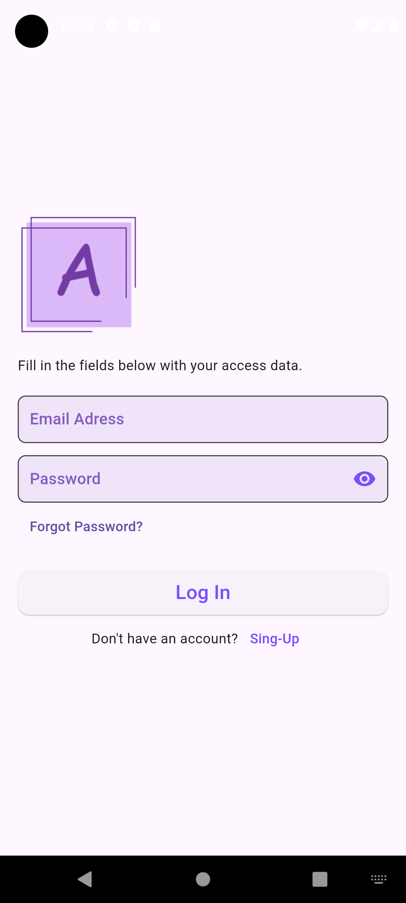
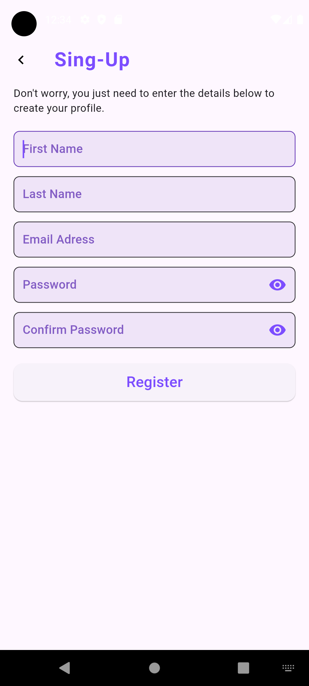
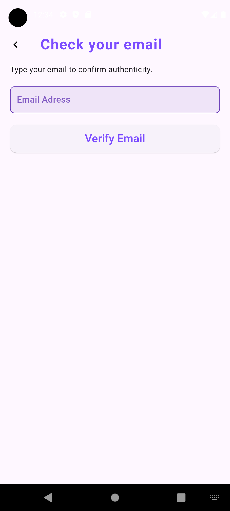
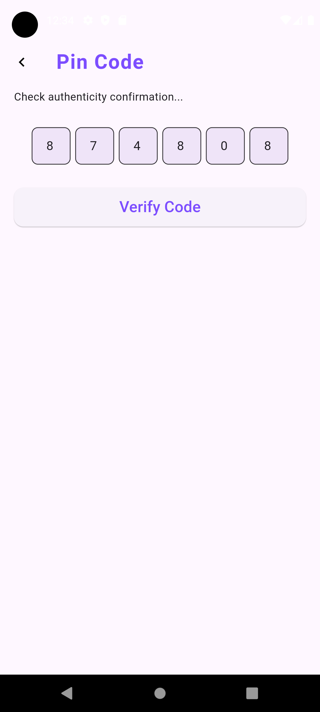
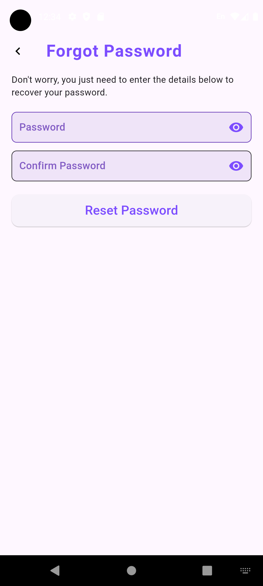
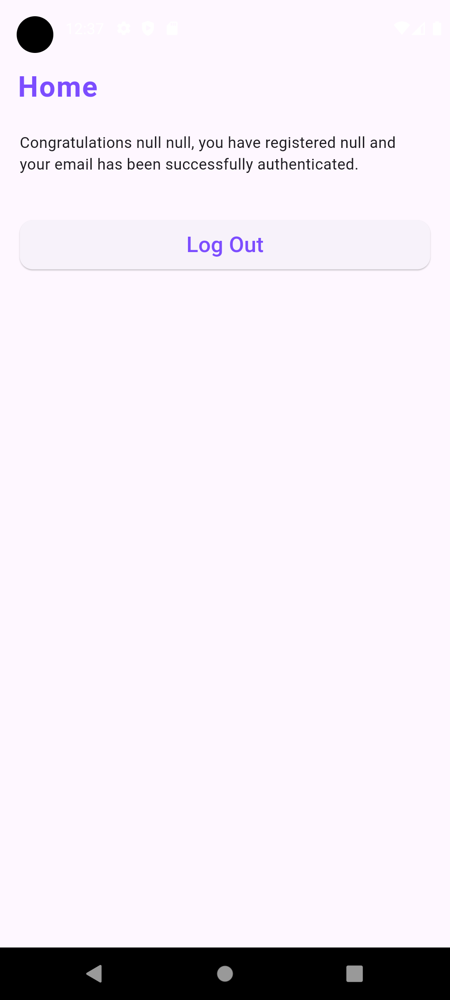

# Authentication

Uma visão geral das funcionalidades da autenticação implementadas em uma aplicação utilizando uma API Node.js e o framework Flutter para desenvolvimento mobile. A autenticação é uma parte crítica de muitos aplicativos, permitindo que usuários protejam suas contas e acessem recursos personalizados. Abaixo estão as funcionalidades básicas e as etapas para configurar a autenticação em sua aplicação.

## Descrição das funcionalidades do Authentication:

1. Registro de Usuário:
    - Os usuários podem se registrar na aplicação fornecendo informações básicas, como nome, sobrenome, email e senha.
    - A API Node.js processará os dados do formulário e criará uma conta de usuário no banco de dados.

2. Login de Usuário
    - Os usuários podem fazer login na aplicação fornecendo suas credenciais de e-mail e senha.
    - A API Node.js autenticará as credenciais fornecidas e fornecerá um token de autenticação válido.

3. Recuperação de Senha
    - Os usuários podem solicitar uma redefinição de senha caso a tenham esquecido.
    - Após validar seu e-mail, um PIN será enviado para confirmar a solicitação.
    - O usuário deve inserir o PIN recebido para poder redefinir sua senha.

4. Logout de Usuário
    - Os usuários podem fazer logout de suas contas, invalidando o token de autenticação anteriormente emitido.
    - Isso garantirá que o acesso não autorizado não seja possível após o logout.

## Exemplo de Fluxo de Autenticação

* O usuário acessa a tela de registro e fornece suas informações.
* O aplicativo envia uma solicitação de registro para a API Node.js.
* A API valida os dados do usuário e cria uma nova conta no banco de dados.
* O usuário é redirecionado para a tela de login.
* O usuário fornece suas credenciais de login.
* O aplicativo envia uma solicitação de login para a API.
* A API verifica as credenciais e emite um token de autenticação.
* O token é armazenado localmente no dispositivo.
* O usuário pode acessar rotas protegidas, como o painel do usuário.
* Quando o usuário decide fazer logout, o token é invalidado.
* Para acessar o painel do usuário novamente, o usuário deve fazer login novamente.

## Configurações da Api

Para mais detalhes sobre a configuração e uso da API, consulte a documentação no repositório: [jfperondini/api-node](https://github.com/jfperondini/api-node)

### Fotos

